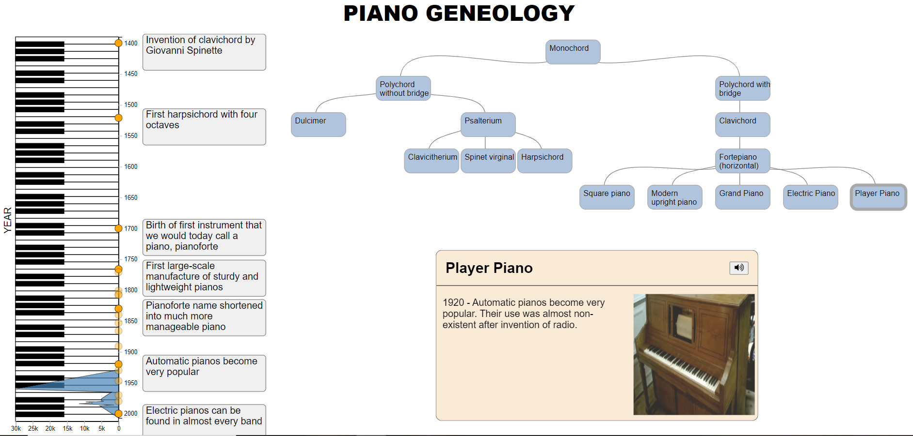

## CS 5630/6630 Final Project - University of Utah

# Piano Geneology

This project guides the user through evolution of the piano. The piano-key timeline highlights important events through history and diplays purchase history (where applicable). The Tree diagram shows the lineage of instruments that led to the modern day piano with its variations.

Click on the Tree nodes to learn more about the instruments and hear an example of what it sounds like!

File structure:

        Piano History.html
        styles.css
        
        data/
        	piano_sales.csv # Historical sales data for modern pianos.
        	piano_history.json # Different piano instruments with ancestors.
        	timeline.csv # Important historical events for piano-like instruments and related events.
        phots/
        	# figures / used in the description
        	# used in event box to display each piano-like instrument
        sounds/
          # full audio files of the different instruments
        sounds_trim/
          # shortened audio files used for the actual visual
        js/
            script.js # Code for the piano keys, purchase history, and timeline events.
            Node.js # Constructor for json data for tree visual
            Tree.js # Code for the creation of the Tree as well as the event box related to the tree
